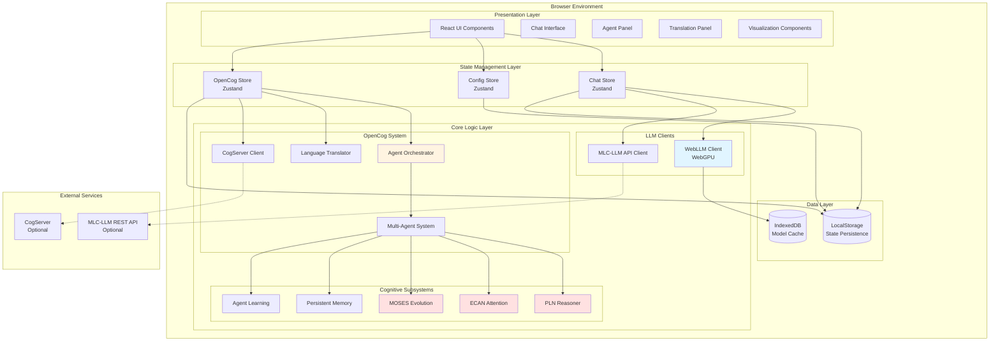
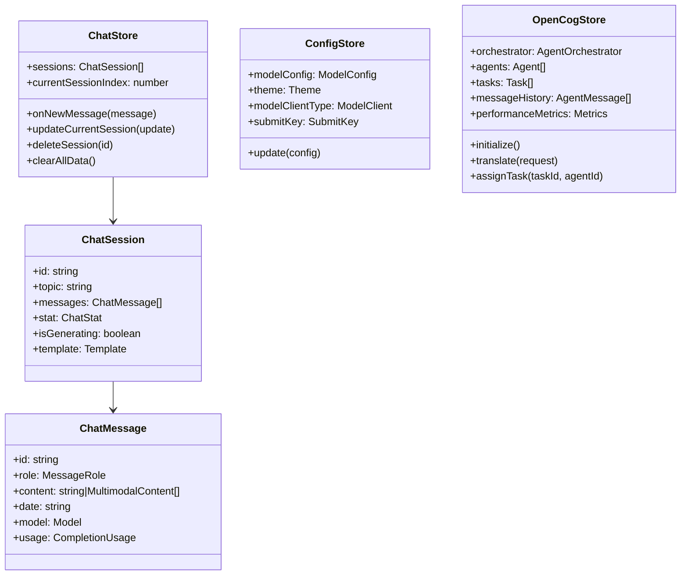
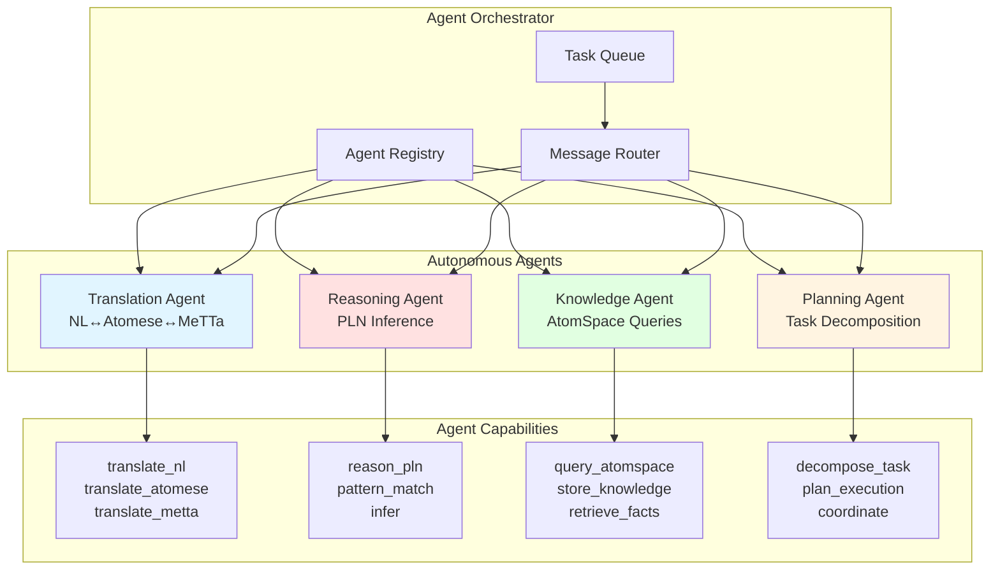
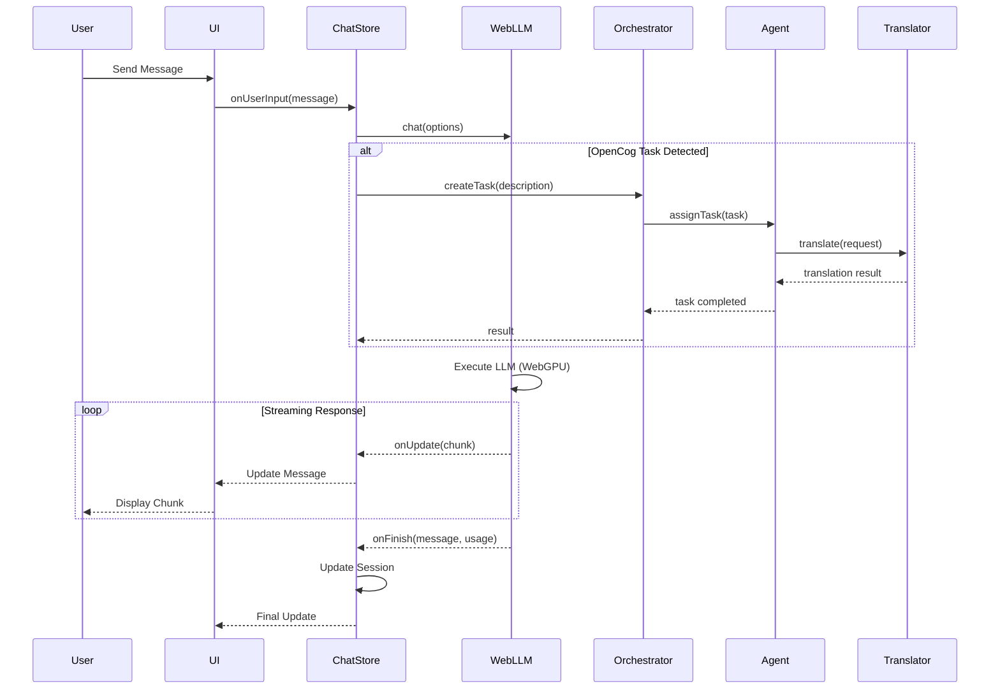
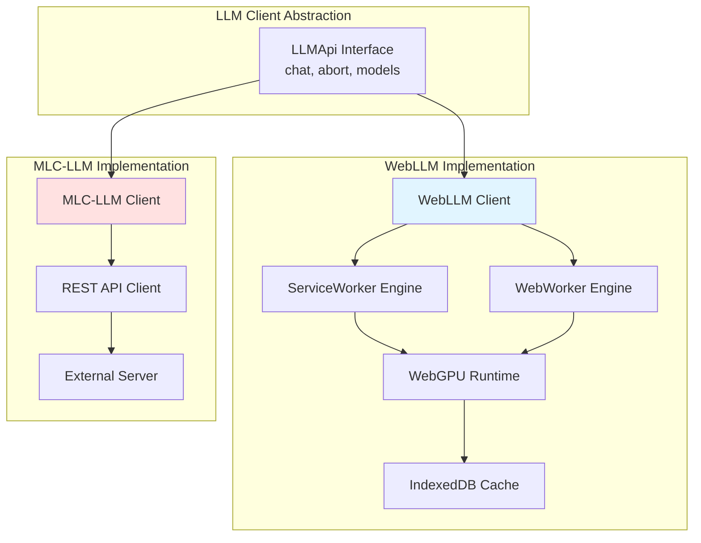
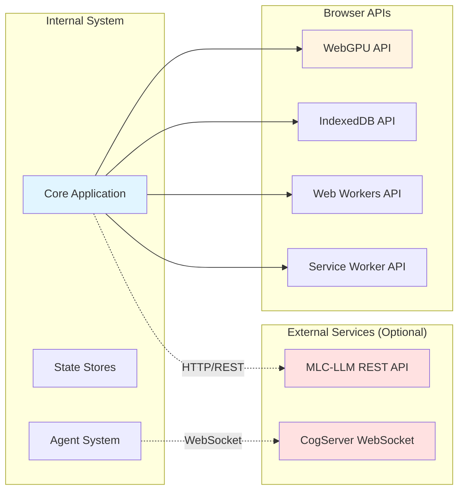
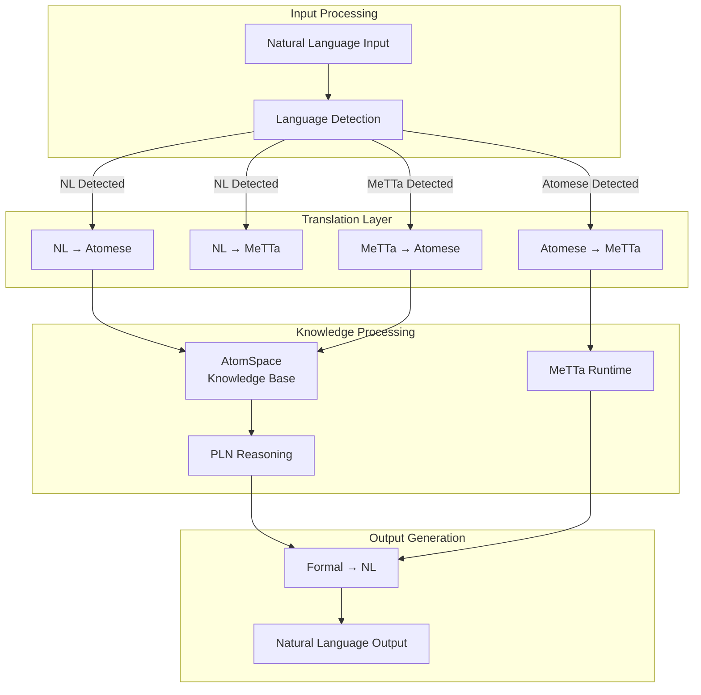
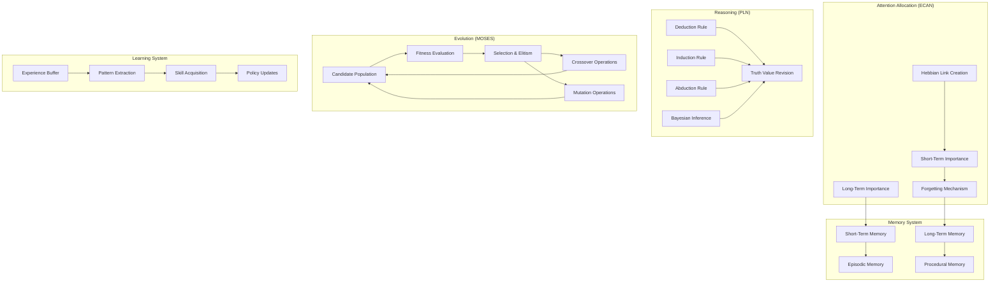
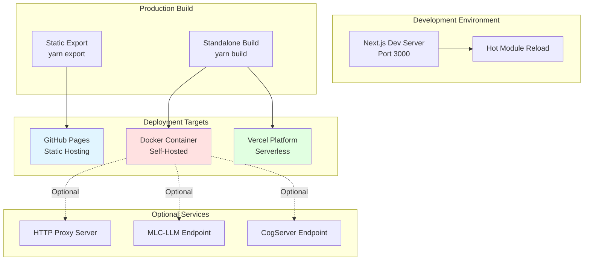
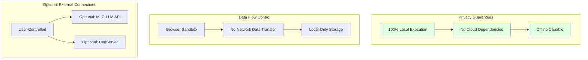

# WebLLM Chat - Technical Architecture Documentation

## Executive Summary

WebLLM Chat is a browser-native AI chat application that combines WebLLM (in-browser LLM execution) with OpenCog's multi-agent orchestration system. The system enables private, offline-capable AI conversations with advanced cognitive capabilities through formal knowledge representation (Atomese and MeTTa).

**Key Architectural Characteristics:**
- **Client-side Architecture**: All processing occurs in the browser using WebGPU
- **Multi-Agent System**: Autonomous agents for translation, reasoning, knowledge management, and planning
- **Hybrid Knowledge Representation**: Natural language + formal languages (Atomese/MeTTa)
- **State Management**: Zustand-based reactive stores with persistence
- **Modular Design**: Clear separation between LLM clients, cognitive systems, and UI

## System Architecture Overview

## Component Architecture

### 1. State Management Layer

### 2. Multi-Agent System Architecture

### 3. Data Flow Architecture

### 4. LLM Client Architecture

## Integration Boundaries

## Knowledge Representation Flow

## Cognitive System Architecture

## Deployment Architecture

## Technology Stack Summary

| Layer | Technologies |
|-------|-------------|
| **Framework** | Next.js 13, React 18, TypeScript 5 |
| **State Management** | Zustand 4 with persistence middleware |
| **LLM Execution** | @mlc-ai/web-llm (WebGPU), WebAssembly |
| **Cognitive System** | OpenCog (Atomese, MeTTa, PLN, ECAN, MOSES) |
| **UI Components** | React components with CSS modules, Sass |
| **Markdown Rendering** | react-markdown, rehype-highlight, remark-gfm |
| **Diagrams** | Mermaid.js for visualization |
| **Build Tools** | Webpack 5, SWC, Babel |
| **Code Quality** | ESLint, Prettier, Husky, lint-staged |
| **PWA** | Service Worker, @serwist/next |
| **Storage** | IndexedDB (model cache), LocalStorage (state) |

## Security & Privacy Architecture

## Performance Characteristics

| Aspect | Characteristic |
|--------|----------------|
| **Model Loading** | One-time download, cached in IndexedDB |
| **Inference** | WebGPU acceleration, browser-native |
| **Latency** | 50-500ms per token (hardware dependent) |
| **Memory** | 2-8GB RAM for typical models |
| **Storage** | 1-10GB for model weights |
| **Scalability** | Single-user, local execution only |

## Future Architecture Considerations

1. **Distributed Agent Systems**: Multi-device agent coordination
2. **P2P Knowledge Sharing**: Decentralized AtomSpace synchronization
3. **Advanced Reasoning**: Integration of additional cognitive architectures
4. **Model Fine-tuning**: In-browser model adaptation
5. **Multi-modal Processing**: Enhanced vision and audio capabilities

## References

- [WebLLM Documentation](https://github.com/mlc-ai/web-llm)
- [OpenCog Framework](https://opencog.org/)
- [Next.js Documentation](https://nextjs.org/docs)
- [Zustand State Management](https://github.com/pmndrs/zustand)
